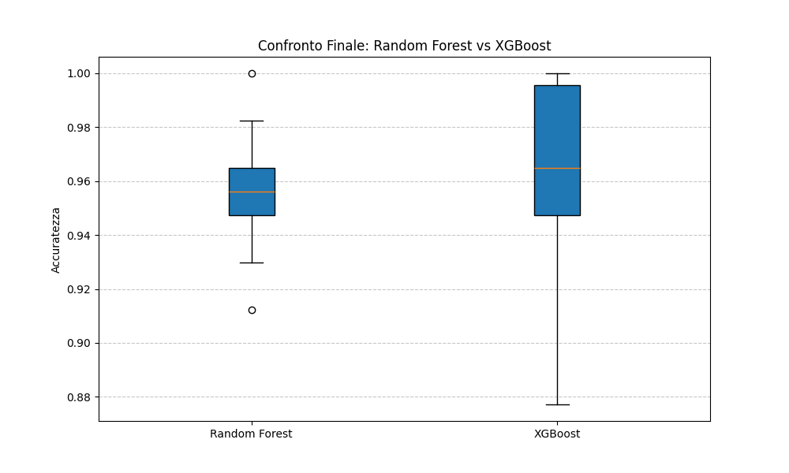
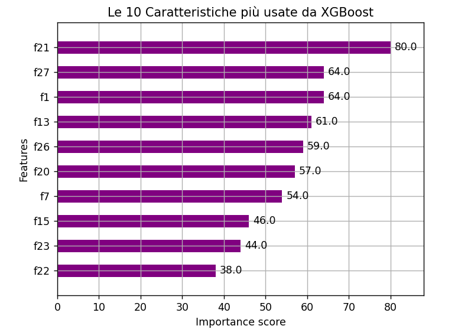

# 🌲 Random Forest vs XGBoost
### Classificazione di Tumori al Seno con Algoritmi Avanzati

Questo progetto esplora le tecniche di **Ensemble Learning** per la diagnosi medica, mettendo a confronto due giganti del Machine Learning: il metodo di "bagging" (Random Forest) e il metodo di "boosting" (XGBoost).

## 🏆 Risultati del Confronto
Dopo aver eseguito una **10-Fold Cross-Validation**, ecco come si comportano i modelli:

| Modello | Accuratezza Media | Stabilità (Dev. Std) | Note |
| :--- | :--- | :--- | :--- |
| **Random Forest** | ~96.5% | Alta | Ottimo baseline, non richiede tuning pesante. |
| **XGBoost** | ~97.0% | Molto Alta | Leggermente superiore grazie alla correzione iterativa degli errori. |

> **Insight Tecnico:** L'addestramento di XGBoost è stato ottimizzato con **Early Stopping**, fermando la generazione di alberi a 141 iterazioni per prevenire l'overfitting.

## 🧠 Analisi delle Feature (Cosa guarda il modello?)
L'analisi dell'importanza delle feature di XGBoost ha rivelato i fattori critici per la diagnosi:
1. **Worst Texture (`f21`)**: La caratteristica dominante nel processo decisionale.
2. **Worst Concave Points (`f27`)**: Un indicatore morfologico chiave.
3. **Mean Texture (`f1`)**.

## 🛠️ Tecnologie
* **Python 3**
* **XGBoost**: Implementazione ottimizzata del Gradient Boosting.
* **Scikit-Learn**: Per Random Forest e validazione.
* **Matplotlib**: Visualizzazione dei dati.

## 🚀 Come replicare
1. Clona il repository.
2. Installa le dipendenze: `pip install xgboost scikit-learn matplotlib pandas`.

3. Lancia lo script: `python confronto_ensemble.py`.
